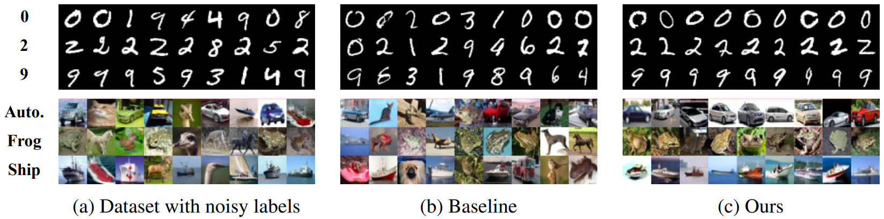
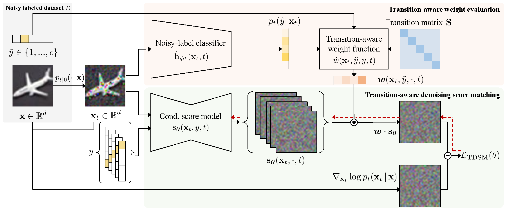

# Label-Noise Robust Diffusion Models (TDSM) (ICLR 2024)

| [openreview](https://openreview.net/forum?id=HXWTXXtHNl) | [datasets](https://www.dropbox.com/scl/fo/807h7bai3qdjwhcq1n0qz/h?rlkey=3z68jap6zifzuf3hxey4jqs2e&dl=0) | [checkpoints](https://www.dropbox.com/scl/fo/rcwt17apifn5qv02bl7hq/h?rlkey=8dvxa8yupjpc98aflgphdwajg&dl=0) |

--------------------

This repo contains an official PyTorch implementation for the paper "[Label-Noise Robust Diffusion Models](https://openreview.net/forum?id=HXWTXXtHNl)" in [ICLR 2024](https://iclr.cc/Conferences/2024).

**[Byeonghu Na](https://sites.google.com/view/byeonghu-na), [Yeongmin Kim](https://sites.google.com/view/yeongmin-space), [HeeSun Bae](https://sites.google.com/view/baeheesun), Jung Hyun Lee, Se Jung Kwon, [Wanmo Kang](https://sites.google.com/site/wanmokang), and [Il-Chul Moon](https://aai.kaist.ac.kr/bbs/board.php?bo_table=sub2_1&wr_id=3)**   


--------------------

This paper proposes **Transition-aware weighted Denoising Score Matching (TDSM)** objective for training conditional diffusion models with noisy labels.





## Requirements

The requirements for this code are the same as those outlined for [EDM](https://github.com/NVlabs/edm#requirements).

In our experiment, we utilized 8 NVIDIA Tesla P40 GPUs, employing CUDA 11.4 and PyTorch 1.12 for training.

## Datasets

Datasets follow the same format used in [StyleGAN](https://github.com/NVlabs/stylegan3?tab=readme-ov-file#preparing-datasets) and [EDM](https://github.com/NVlabs/edm?tab=readme-ov-file#preparing-datasets), where are stored as uncompressed ZIP archives containing uncompressed PNG files, accompanied by a metadata file `dataset.json` for label information.

**Noisy Labeled Dataset**

For the benchmark datasets, we add arguments to adjust the noise type and noise rate. 
You can change `--noise_type` ('sym', 'asym') and `--noise_rate` (0 to 1).  

For example, the script to contruct the CIFAR-10 dataset under 40\% symmetric noise is:

```.bash
python dataset_tool.py --source=downloads/cifar10/cifar-10-python.tar.gz \
    --dest=datasets/cifar10_sym_40-32x32.zip --noise_type=sym --noise_rate=0.4
```

Additionally, we provide the noisy labeled datasets that we used by this [link](https://www.dropbox.com/scl/fo/807h7bai3qdjwhcq1n0qz/h?rlkey=3z68jap6zifzuf3hxey4jqs2e&dl=0).

First download each dataset ZIP archive, then replace `dataset.json` file in the ZIP archive with the corresponding json file.

## Training

### Classifiers 

You can train new classifiers using `train_classifier.py`. For example:

```.bash
torchrun --standalone --nproc_per_node=1 train_classifier.py --outdir=classifier-runs \
    --data=datasets/cifar10_sym_40-32x32.zip --cond=1 --arch=ddpmpp --batch 1024
```

### Label-Noise Robust Diffusion Models

You can train the diffusion models with the TDSM objective using `train_noise.py`. For example:

```.bash
torchrun --standalone --nproc_per_node=8 train_noise.py --outdir=noise-runs \
    --data=datasets/cifar10_sym_40-32x32.zip --cond=1 --arch=ddpmpp \
    --cls=/path/to/classifier/network-snapshot-200000.pkl \
    --noise_type=sym --noise_rate=0.4
```

### Pre-trained Models

We provide the pre-trained models for classifiers, baselines, and our models on noisy labeled datasets by this [link](https://www.dropbox.com/scl/fo/rcwt17apifn5qv02bl7hq/h?rlkey=8dvxa8yupjpc98aflgphdwajg&dl=0).

## Generate Samples

You can generate samples using `generate.py`. For example:

```.bash
python generate.py --seeds=0-63 --steps=18 --class=0 --outdir=/path/to/output \
    --network=/path/to/score
```
## Acknowledgements

This work is heavily built upon the code from:
* [Karras, T., Aittala, M., Aila, T., & Laine, S. (2022). Elucidating the design space of diffusion-based generative models. *Advances in Neural Information Processing Systems, 35, 26565-26577*.](https://github.com/NVlabs/edm)

## Citation

```
@inproceedings{
na2024labelnoise,
title={Label-Noise Robust Diffusion Models},
author={Byeonghu Na and Yeongmin Kim and HeeSun Bae and Jung Hyun Lee and Se Jung Kwon and Wanmo Kang and Il-Chul Moon},
booktitle={The Twelfth International Conference on Learning Representations},
year={2024},
url={https://openreview.net/forum?id=HXWTXXtHNl}
}
```
